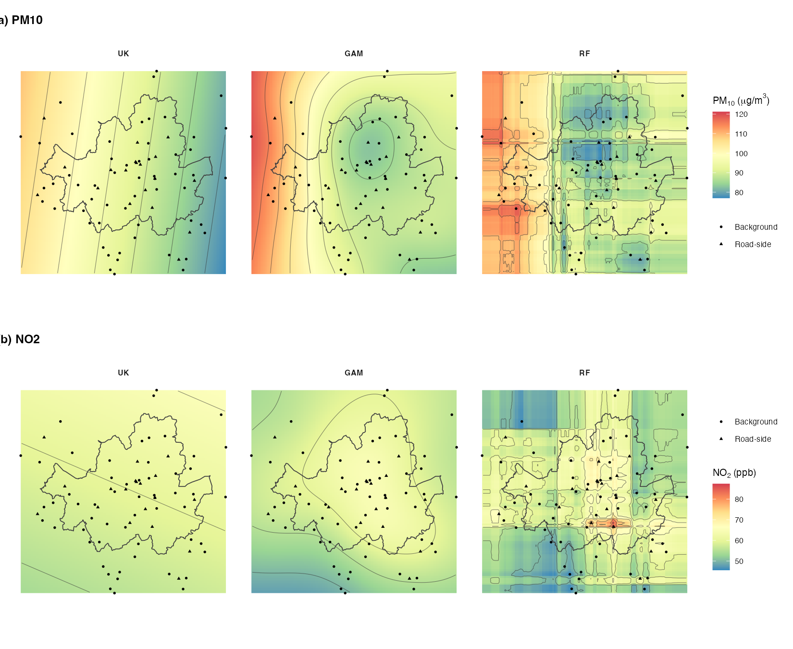
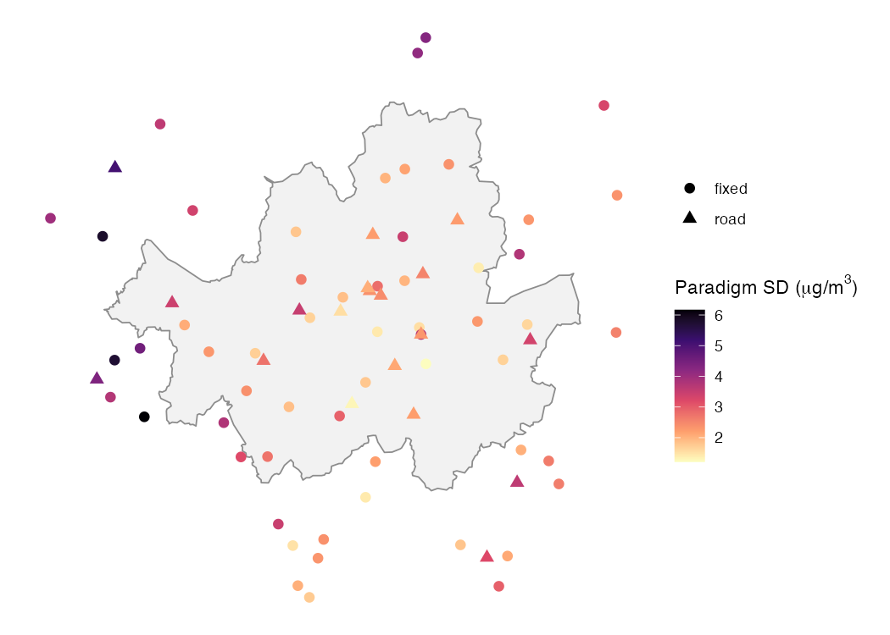
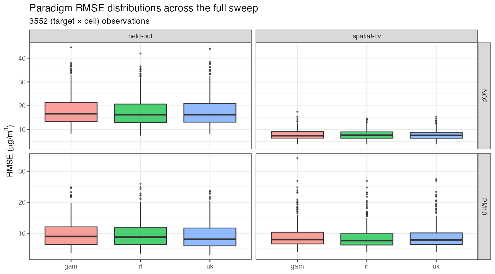

```{r}
#| label: setup
#| include: false

# Resolve the package whether it is dev-loaded, installed locally, or
# missing. This makes the manuscript reproducible from a clone of the
# repo without requiring the user to first run `R CMD INSTALL`.
if (!requireNamespace("aqsurface", quietly = TRUE)) {
  if (requireNamespace("pkgload", quietly = TRUE)) {
    pkgload::load_all("..", export_all = FALSE, helpers = FALSE)
  } else {
    stop("Install aqsurface first: devtools::install('..').")
  }
}

library(aqsurface)
library(dplyr)
library(ggplot2)
library(sf)

knitr::opts_chunk$set(fig.width = 6, fig.height = 4,
                      fig.align = "center", out.width = "85%")
```

# Introduction

## Air pollution and population exposure in Seoul

Population health has been seriously threatened by daily ambient
air pollution in South Korea. Despite the efforts to legislate
national pollution standards, daily peaks in recent winters and
springs have already exceeded the standards countless times.
During 5-8 March 2019, the entire country experienced over
200 µg/m³ of PM~10~ and smog episodes; the national authorities
warned everyone to reduce outdoor activities. As most of Seoul's
areas tend to experience disastrous levels of pollution
frequently, residents can be exposed to air pollution
unconsciously, which in the long term can lead to respiratory or
cardiovascular ailments [@Zhang2013]. Thus, understanding the
spatial and temporal aspects of air pollution and its relationship
with exposure is crucial.

Exposure research has exploited spatial interpolation (SI) to
investigate the relationship between ambient air pollution and
population exposure in a spatial context, namely "which places
have high air pollution?" and "how many people can potentially
become unwell from high episodes?" [@Jerrett2005; @Hoek2008;
@LimLee2024]. SI is a statistical method that can compute
pollution fields over a wide area with a given set of point
measurements. SI can mainly be split into a group that follows
the assumption of spatial autocorrelation (e.g. Inverse Distance
Weighted (IDW), kriging) and a group on statistical inference
such as generalised linear models and generalised additive models
[@Wood2017]. Methods that take spatial autocorrelation into
account assume that the values tend to be more similar when
closer together, whereas methods that use statistical inference
delineate the inferential surfaces over a region by minimising
the residuals of the model. A third group, machine learning
(e.g. random forests, [@Wright2017]), treats coordinates and
station-level covariates as features without imposing any spatial
structure a priori.

However, when air pollution monitoring stations such as those in
Seoul are small in number compared to the size of the city, the
estimation of the potential population at risk due to air
pollution can be completely different depending on the
measurement method used [@Wu2019]. Wong, Yuan and Perlin
[-@Wong2004] used four spatial interpolation methods (spatial
averaging, nearest neighbour, IDW, and kriging) to estimate
children's exposure to air pollution across the USA. The
outcomes of the four methods only showed a small difference of
PM10 and O3 where the monitoring stations were denser, for
example in the north-eastern cities and urban California, but
were difficult to predict in the mountainous regions and
high-altitude zones. Aalto et al. [-@Aalto2013] compared a
Generalised Additive Model (GAM) and ordinary kriging (OK) to
predict monthly mean temperature and precipitation in Finland
and found that the GAM outperformed other methods by a small
amount, but the biased distribution of stations
("concentrated in the urban areas" of Finland) might have evened
out the RMSE measures.

In addition, previous studies have provided tentative estimates
of population risk based on annual or monthly statistics, but the
aggregated figure lacks the potential for including acute
injuries after an abrupt pollution rise, which may be more severe
in their health consequences. Short-term ambient PM2.5 exposure
is associated with a 0.67% increase in all-cause mortality among
older adults per 10 µg/m³ over 2-day windows [@Di2017], and the
multi-city analysis of Liu et al. [-@Liu2024] across 380 urban
areas confirms substantial temporal heterogeneity in the
short-term effect that an annual mean would average out. The
statistical machinery linking SI choices to this temporal axis
has been described by Goldman et al. [-@Goldman2011], where the
spatial misalignment between sparse monitoring stations and dense
population locations interacts with the temporal aggregation
window to bias short-term effect estimates. There is likely to
be a greater difference between methods when the population at
risk is measured at a finer temporal scale, which is exactly the
regime in which short-term exposure surveillance must operate.

This article aims to compare spatial interpolation methods that
can support estimating population exposure to daily air pollution
in Seoul. The study compares Universal Kriging (UK, geostatistics),
Generalised Additive Models (GAM, statistical inference), and
Random Forest (RF, machine learning) at the day-night scale
(12 h mean), and examines whether explicit station-type covariates
can remove the systematic bias between background and road-side
monitors. The study also argues that the choice of validation
strategy may matter more than the choice of algorithm, and that
wall-clock cost per fit appears to be the dimension on which the
three paradigms truly separate.

## A three-paradigm framing of the literature

Empirical comparisons of spatial interpolation methods for urban
air quality have multiplied since Wong et al. [-@Wong2004]
introduced inverse distance weighting, ordinary kriging and the
nearest-neighbour method to a PM10 and O3 study of the United
States monitoring network. The literature surveyed in @tbl-lit
is broadly consistent in that no single method is uniformly best,
and the relative ranking tends to vary with station density,
study extent and the choice of error metric [@Aalto2013;
@Parmentier2014; @Zhang2015]. However, each new study still
reports a leaderboard in which one method is declared the winner
on the basis of leave-one-out or in-sample root-mean-square error
(RMSE), and the corresponding R package implementations rarely
accompany the publication.

The modelling literature on urban air quality interpolation can
be organised into three distinct paradigms that are rarely
compared head to head. The first is geostatistics, exemplified
by universal kriging in `gstat` [@Pebesma2004], which assumes a
covariance structure tied to spatial separation and predicts via
the best linear unbiased combination of observations. The second
is statistical inference, exemplified by generalised additive
models in `mgcv` [@Wood2017], which makes no covariance
assumption and fits a smooth (typically thin-plate) regression
surface with REML-selected smoothing parameters. The third is
machine learning, exemplified by random forests in `ranger`
[@Wright2017], which treats coordinates and station-level
covariates as features for an ensemble of regression trees and
does not impose any spatial structure a priori.

Within-paradigm comparisons are abundant, but cross-paradigm
comparisons that fix the data, the validation regime, and the
software environment are not. Where they do exist, they tend to
evaluate prediction accuracy alone, while the wall-clock cost of
fitting is rarely reported. For practitioners, however, this can
be the wrong question, since a method that is fractionally more
accurate but considerably slower may not be preferable when the
analysis must scan across 5 months by 3 decades by 20 daily
columns by 2 pollutants, as in the present Seoul case study
(approximately 1200 fit-and-predict invocations).

In addition, two methodological choices that are made before the
paradigm selection appear to matter at least as much. With
respect to validation strategy, in-sample RMSE for universal
kriging on a constant trend collapses to numerical zero because
kriging exactly interpolates its observations, so any comparison
against a smoothing method may be structurally biased. With
respect to covariate inclusion, when a study trains exclusively
on background monitors and validates at road-side monitors, all
three paradigms tend to underestimate the road-side concentration
by several µg/m³, and this systematic bias can be closed by
adding a single station-type factor as a covariate, regardless of
paradigm.

The contribution of this article can therefore be summarised in
three parts: a three-paradigm reframing of the comparison
literature, a joint speed-accuracy benchmark across PM10 and NO2
on the Seoul network, and the aqsurface R package that
operationalises the benchmark in one function call. The empirical
work uses a 76-station Seoul monitoring network with one
representative algorithm per paradigm: universal kriging
(geostatistics), thin-plate-spline GAM (statistical inference),
and random forest (machine learning). The aqsurface R package,
released as the companion to this article (version 0.0.1,
MIT-licensed, repository at
<https://github.com/dataandcrowd/aqsurface>), implements the
benchmark as a one-call function `benchmark_methods()` that
returns a long-format tibble keyed by (algorithm, strategy,
target) and carries both `rmse` and `time_s`. The package is
currently in the "experimental" lifecycle stage and has not yet
been submitted to CRAN. Readers can install the development
version with `remotes::install_github("dataandcrowd/aqsurface")`
and reproduce every table and figure in this article by sourcing
`paper/figures.R`.

```{r}
#| label: tbl-lit
#| tbl-cap: "Comparative spatial interpolation studies and validation choices."
#| echo: false

lit <- tibble::tribble(
  ~Authors,                              ~Region,           ~Pollutant,        ~N,        ~Methods,                     ~Validation,
  "Wong et al. (2004)",                  "USA",             "PM~10~, O~3~",        "732/739", "IDW, OK, NN",                "LOOCV (R²)",
  "Deligiorgi & Philippopoulos (2011)",  "Athens",          "NO~2~, O~3~",         "10",      "IDW, OK, NN, ANN",           "LOOCV (MAE)",
  "Aalto et al. (2013)",                 "Finland",         "Temp, precip",    "207/20",  "KED, GAM, GK",               "RMSE, MAD",
  "Parmentier et al. (2014)",            "Oregon, USA",     "Temperature",     "200-300", "UK, GWR, GAM",               "RMSE, MAE",
  "Zhang & Shen (2015)",                 "Xi'an, China",    "PM2.5",           "13",      "IDW, OK, Trend surfaces",    "ME, MAE, RMSE",
  "This study",                          "Seoul, S. Korea", "PM10, NO2",       "76",      "UK, GAM, RF",                "in-sample / spatial CV / held-out"
)
knitr::kable(lit)
```

# Data

The case study uses the Seoul Metropolitan Air Quality Monitoring
Network operated by the Korea Environment Corporation (KECO). 76
fixed-position monitors are located within a 10 km buffer of the
Seoul administrative boundary, of which 57 are designated as
background sites and 19 as road-side sites. PM10 concentrations
are recorded hourly (in µg/m³) and aggregated into day
(08:00-19:00) and night (20:00-07:00) means. The analysis
presented here uses ten consecutive days in January 2014
(decade S1) for the headline result.

Station coordinates use the Korea Central Belt 2000 / Mean Sea
Level Bessel projection (EPSG:5181). Per-station covariates
provided by KECO include Road_Dist (the distance to the nearest
road, in metres) and DEM (the elevation, in metres). The
contrast between the dense urban core and the surrounding
mountainous fringe can be observed clearly, and is one of the
reasons why the legacy validation strategy (training on
background stations and validating at road-side stations) tends
to produce a structural bias. @fig-stations shows the station
layout.

```{r}
#| label: fig-stations
#| fig-cap: "Seoul air quality monitoring stations: 57 background (Fixed) and 19 road-side monitors used in this study, overlaid on the Seoul administrative boundary (simplified). The Han River corridor and the mountainous fringe to the north of the city are both visible as gaps in the monitor coverage."
#| fig-height: 4.5
#| echo: false

data("stations_demo", package = "aqsurface")

# Optionally overlay the Seoul administrative boundary if it has been
# generated by data-raw/create_sample_data.R.
seoul_boundary <- tryCatch({
  e <- new.env()
  utils::data("seoul_boundary", package = "aqsurface", envir = e)
  e$seoul_boundary
}, error = function(e) NULL, warning = function(w) NULL)

have_ggspatial <- requireNamespace("ggspatial", quietly = TRUE)

p_stations <- ggplot()
if (!is.null(seoul_boundary)) {
  p_stations <- p_stations +
    geom_sf(data = seoul_boundary,
            fill = "grey95", colour = "grey55", linewidth = 0.4)
}
p_stations <- p_stations +
  geom_sf(data = stations_demo,
          aes(colour = station_type, shape = station_type),
          size = 2.4, stroke = 0.5) +
  scale_colour_manual(
    values = c("fixed" = "#1f77b4", "road" = "#d62728"),
    name = "Station type",
    labels = c("Background (Fixed, n = 57)",
               "Road-side (n = 19)")
  ) +
  scale_shape_manual(
    values = c("fixed" = 16, "road" = 17),
    name = "Station type",
    labels = c("Background (Fixed, n = 57)",
               "Road-side (n = 19)")
  ) +
  coord_sf(crs = 5181, datum = NA)

# Cartographic essentials: scale bar + north arrow (ggspatial) when
# the package is available; otherwise the map renders without them.
if (have_ggspatial) {
  p_stations <- p_stations +
    ggspatial::annotation_scale(
      location = "bl", width_hint = 0.25, line_width = 0.4,
      text_cex = 0.7, pad_x = grid::unit(0.4, "cm"),
      pad_y = grid::unit(0.4, "cm")
    ) +
    ggspatial::annotation_north_arrow(
      location = "tr", which_north = "true",
      height = grid::unit(1.0, "cm"), width = grid::unit(0.8, "cm"),
      pad_x = grid::unit(0.4, "cm"), pad_y = grid::unit(0.4, "cm"),
      style = ggspatial::north_arrow_minimal()
    )
}

p_stations +
  theme_minimal(base_size = 11) +
  theme(
    panel.grid = ggplot2::element_blank(),
    axis.text  = ggplot2::element_blank(),
    axis.title = ggplot2::element_blank(),
    legend.position = "bottom",
    legend.title    = ggplot2::element_text(size = 9),
    legend.text     = ggplot2::element_text(size = 9),
    plot.background = ggplot2::element_rect(fill = "white",
                                            colour = NA)
  )
```

# Methods

## Geostatistics: Universal Kriging

Kriging is a geostatistical method that interpolates an unknown
location using the characterised mean and variance structures
[@Kumar2007; @Kim2014]. It assumes that the overall mean,
distance, and variance of all observations are spatially
autocorrelated from Tobler's First Law of Geography, namely that
"everything is related to everything else, but nearer things are
more related than distant things". For example, pollution
concentrations that are less than 1 metre apart are likely to be
similar, but less likely to be similar when the distance becomes
larger. To create a kriged map, three steps are required:
(i) modelling an empirical semivariogram, (ii) fitting the
empirical model with a mathematical model, and (iii) choosing
the type of kriging according to the assumptions about the data
(normality, stationarity, and the presence of trends).

The empirical semivariogram $\hat{\gamma}(h)$ at lag $h$ is the
half-mean-squared difference between observations separated by
that distance. In practice, pairs are binned by distance (ten
bins to a 30 km cutoff are used in this study), the mean
variance per bin is taken, and an asymptotic theoretical curve
(the model semivariogram) is fitted by least squares. From this
curve, three parameters can be derived: the nugget (the variance
at lag zero, capturing measurement error and sub-sample-spacing
variation), the partial sill (the asymptote minus the nugget),
and the range (the lag at which the semivariogram levels off).

Variogram fitting is harder than its routine treatment in the
literature would suggest. Three issues recur in the Seoul
network. First, the 57 background stations occupy approximately
40 km by 30 km but are not uniformly distributed: more than half
of them are clustered in central Seoul, while the surrounding
districts are sparse. The sparsity tends to inflate uncertainty
in long-lag bins, and unexpected outliers such as mountain
ridges between station pairs may contradict the autocorrelation
assumption. Second, theoretical semivariograms come in many
families (spherical, circular, Gaussian, exponential,
Stein-Matern, and so on), and the choice is largely empirical;
the automatic fit is not always reliable. Third, the user has to
constrain the spatial lag: too short a lag misses long-range
variability, while too long a lag includes pairs that are no
longer autocorrelated. A 30 km lag is used throughout this study.
A pure-nugget fit, finally, can yield a bull's-eye map
(overfitting on local stations), while a flat fit can yield a
smooth, contour-less map (underfitting). The function `fit_uk()`
in aqsurface defaults to a Stein-Matern model, falls back to a
spherical model with sensible starting values when that fit
fails, and finally to a pure-nugget model so that downstream
code is guaranteed an output.

For prediction, this article uses **Universal Kriging** (UK), a
generalisation that allows a deterministic trend in the mean (e.g.
a covariate such as `station_type`) and removes the stationarity
assumption of Ordinary Kriging. UK is mathematically equivalent to
Kriging with External Drift [@Aalto2013].

## Statistical inference: Generalised Additive Models

The Generalised Linear Model (GLM) and the Generalised Additive
Model (GAM) are regression methods that predict a response
variable $Y$ based on explanatory variables $X$. Compared to GLM,
GAM uses combinations of linear and non-linear smoothings of
explanatory variables to predict response variables, and is
therefore a semi-parametric model in which the assumptions are
generous and the relationships between $Y$ and $X$ can be
non-linear [@Wood2017]. For the application in this study, the
response (PM10 or NO2 concentration) is modelled as a smooth
function of the spatial coordinates,

$$
y_i = \beta_0 + s(X_i, Y_i) + \mathbf{x}_i^\top \boldsymbol{\beta}
       + \varepsilon_i,
$$

where $s(X, Y)$ is a thin-plate spline and $\mathbf{x}_i$
collects optional parametric covariates such as `station_type`,
`Road_Dist` or `DEM`. The smoothing parameter is selected by
restricted maximum likelihood (REML), which is the modern default
in `mgcv` and tends to be more stable than ML on small networks.

GAM does not impose the spatial-autocorrelation assumption that
kriging requires, but instead minimises the residuals of the
penalised regression directly. As Wood [-@Wood2017] notes, GAM's
$p$-values are conditional on the smoothing penalty and should
be interpreted with care; the robustness of the model can be
better diagnosed by the estimated degrees of freedom (edf), the
deviance explained, and visual inspection of partial-effect
plots.

## Machine learning: Random Forest

A random forest [@Wright2017] is an ensemble of regression trees
that treats the spatial coordinates and any covariates as
features, without imposing a spatial covariance structure a
priori. Each tree is fit to a bootstrap resample of the training
data using a random subset of features at each split, and the
ensemble prediction is the mean across the trees. In this study
`ranger::ranger()` is used with 500 trees and the default
`respect.unordered.factors = "order"` setting, which is
appropriate for the small two-level `station_type` factor.

RF carries no spatial-autocorrelation assumption and no smoothing
penalty, and its inductive bias comes entirely from the bagging
and splitting procedure. When coupled with covariates such as
`Road_Dist` or `DEM`, RF can capture non-additive interactions
between location and station type, which kriging and additive
GAMs typically cannot.

## Road-side adjustment via an empirical ratio

The legacy analysis of this network introduced a post-processing
step that the present article retains for historical
compatibility and exposes as the function `apply_road_ratio()`.
After fitting the spatial surface on the 57 background monitors,
road pixels (and highway pixels separately) are multiplied by an
empirical Back-to-Road ratio computed from the per-day means of
the 19 road-side monitors:

$$
r_t^{\text{road}} \;=\; \frac{\overline{C_t^{\text{road}}}}{\overline{C_t^{\text{back}}}},
\qquad
\widehat{C}_{x,t}^{\text{adjusted}} \;=\;
\widehat{C}_{x,t} \cdot \begin{cases}
   r_t^{\text{road}} & \text{if } x \in \text{road pixels},\\
   r_t^{\text{high}} & \text{if } x \in \text{highway pixels},\\
   1 & \text{otherwise}.
\end{cases}
$$

This is a heuristic correction. It assumes that the
multiplicative relationship between background and road-side
concentrations is constant across the network, which is not
necessarily the case: the ratio at a road in central Seoul tends
to be much higher than at a road in the suburbs even on the same
day. The covariate approach taken later in this article (training
all paradigms on the combined network with `station_type` as a
factor) can supersede the ratio approach in two respects. First,
it allows each paradigm to learn the spatial gradient between
the two populations rather than imposing a global multiplier.
Second, it generalises to additional covariates such as the
distance to the nearest road, elevation, or traffic counts,
which the ratio formulation cannot accommodate.
`apply_road_ratio()` is retained because it can be a useful
baseline and because it makes the connection to the legacy
literature explicit, but the covariate path is recommended for
new work.

## Three validation strategies

A held-out set is a subset of the data that the model never
sees during fitting and is used solely to estimate prediction
error. It can be contrasted with two other regimes that often
appear in the literature: in-sample evaluation, where the same
observations are used for both training and testing, and
cross-validation, where each observation is held out from the
fit in exactly one fold and used for fitting in the rest. The
three regimes differ in the strength of the generalisation
claim they support: in-sample evaluation tends to underestimate
the error, since the model has already seen the answer; CV
estimates the error on unseen locations from the same population;
and a held-out set drawn from a distinct sub-population tests
extrapolation beyond the training distribution. All three are
used in this study:

1. In-sample. Predictions are extracted at the same locations
   used to fit the model. UK with a constant trend interpolates
   exactly, so its in-sample RMSE is essentially zero by
   construction.
2. Spatial cross-validation. The training set is partitioned
   into five spatially compact folds via k-means clustering on
   the coordinates [@Roberts2017; @Meyer2018]. Each fold is
   held out in turn while the model is fit on the remaining
   four. This controls for the spatial autocorrelation that
   random k-fold CV would leak. When `station_type` is used as
   a covariate, the partition is stratified so that every fold
   contains both levels; without stratification, UK can return
   a rank-deficient kriging system on some folds.
3. Held-out validation against road-side monitors. When
   training is restricted to the 57 background monitors, the
   19 road-side monitors form a permanent held-out set, since
   none of these road-side observations are used in fitting.
   The resulting RMSE measures the model's ability to
   extrapolate from the background sub-population to the
   road-side sub-population. This regime is the strongest of
   the three, and is the one practitioners actually need when
   the operational task is to estimate road-side exposure from
   a background-only network. The term "held-out" is preferred
   here over "test set" or "out-of-sample" because the latter
   terms can conflate distribution-shift extrapolation (which
   is tested here) with within-distribution interpolation
   (which spatial CV tests).

For each (paradigm, strategy, target column) combination, the
following are recorded: $n$, RMSE, MAE, bias, Pearson
correlation, and the wall-clock time per fit. Bias is defined
as the mean signed prediction error,
$\mathrm{bias} = \frac{1}{n} \sum_{i=1}^n (\hat{y}_i - y_i)$,
so that a positive value indicates systematic over-prediction
and a negative value systematic under-prediction. Distinguishing
bias from RMSE matters in this study because RMSE captures the
magnitude of error without sign, and two methods can therefore
have identical RMSE while one systematically over-predicts and
the other systematically under-predicts. The 4 µg/m³ road-side
under-estimation reported below is a bias finding rather than
an RMSE finding, since the spatial-CV RMSE for all three
paradigms remains around 10 µg/m³ regardless of whether
`station_type` is included. Per-fold cross-validation timings
are averaged so that the time column is comparable across
strategies.

# The aqsurface package

aqsurface is a self-contained reproducible companion to this article.
The user-facing API consists of three layers:

```r
# 1. Ingestion
read_pollutant_rdata(); load_pollutant(); make_station_sf()

# 2. Modelling primitives
fit_uk();  predict_uk()
fit_gam(); predict_gam()
fit_rf();  predict_rf()

# 3. Composition
combine_stations(); spatial_kmeans_folds(stratify_by = ...)
benchmark_methods(train, holdout, targets, algorithms,
                  covariates = NULL, stratify_by = NULL, ...)

# 4. Legacy post-processing (kept for historical compatibility)
apply_road_ratio(surface, road_raster, ratio); tidy_ratio_table()
```

The package targets sf and terra throughout, dropping the legacy
sp / rgdal / raster dependencies that have been retired from CRAN.
A small Jan S1 demo bundle (~30 KB across four `.rda` files) ships
with the package so the vignettes and examples run without the
original 530 MB monitoring archive.

A typical user session reproduces the headline number in eight
lines:

```r
library(aqsurface); library(sf); library(dplyr)

data("pm10_jan_s1",      package = "aqsurface")
data("pm10_jan_s1_road", package = "aqsurface")
train   <- st_as_sf(pm10_jan_s1,      coords = c("X","Y"), crs = 5181)
holdout <- st_as_sf(pm10_jan_s1_road, coords = c("X","Y"), crs = 5181)

bm <- benchmark_methods(
  train = train, holdout = holdout,
  targets = decade_columns("pm10", 1, "S1"),
  algorithms = c("uk", "gam", "rf"),
  cv_folds = 5, seed = 1, progress = FALSE
)
filter(bm, target == "ALL") |>
  select(algorithm, strategy, rmse, bias, time_s)
#> # A tibble: 9 x 5
#>   algorithm strategy    rmse   bias time_s
#>   <chr>     <chr>      <dbl>  <dbl>  <dbl>
#> 1 gam       held-out   11.2  -4.88   0.18
#> 2 gam       in-sample   7.41  0.00   0.18
#> 3 gam       spatial-cv 10.5  -0.72   0.19
#> 4 rf        held-out   11.2  -4.78   0.05
#> 5 rf        in-sample   4.58 -0.03   0.05
#> 6 rf        spatial-cv 10.0  -0.16   0.05
#> 7 uk        held-out   10.6  -4.13   0.45
#> 8 uk        in-sample   0.00  0.00   0.45
#> 9 uk        spatial-cv 10.5   0.01   0.46
```

aqsurface is released under
the MIT licence; this article accompanies version 0.0.1, the
**experimental** lifecycle stage. CRAN submission is planned after
peer review of the present manuscript. R CMD check on macOS,
Linux, and Windows × R-release / R-devel is automated via GitHub
Actions and passes with zero errors, warnings, or notes at the
time of writing.

## Relation to existing R packages

aqsurface does not introduce a new interpolation algorithm; it
composes existing CRAN packages into a single benchmark
abstraction. @tbl-pkgs shows where it fits in the ecosystem.

```{r}
#| label: tbl-pkgs
#| tbl-cap: "aqsurface in the context of existing CRAN tooling. The first three rows are the algorithm engines this article wraps; the last two rows are the closest functional cousins, focused on machine-learning workflows and on raster-based interpolation respectively."
#| echo: false

pkg_tbl <- tibble::tribble(
  ~Package,    ~`Primary scope`,                                            ~`What aqsurface adds`,
  "gstat",      "Geostatistics: variograms, kriging, simulation",            "Robust fallback chain; per-fit timing; uniform output for benchmarking",
  "mgcv",       "Statistical inference: GAMs, smoothing splines",            "Same; integrates with the same benchmark grammar",
  "ranger",     "Machine learning: random forests in C++ / R",               "Wraps as a third paradigm under one API",
  "CAST",       "Spatial CV folds and target-oriented validation",            "Built-in `spatial_kmeans_folds(stratify_by =)` covers the most common use case without CAST's model-list overhead",
  "intamap",    "Automatic interpolation pipeline (kriging family only)",     "Cross-paradigm comparison rather than within-paradigm autoselection"
)
knitr::kable(pkg_tbl)
```

The contribution is therefore a benchmarking *abstraction*, not a
new interpolation method. Where existing packages provide
single-paradigm depth, aqsurface provides cross-paradigm breadth
plus a uniform speed-accuracy reporting layer.

# Results

```{r}
#| label: load-results
#| include: false

# Loaded from paper/benchmark_results.rds, which is produced by
# paper/figures.R running the three benchmark scenarios on the
# shipped Jan S1 demo bundle.
results_path <- "benchmark_results.rds"
results <- if (file.exists(results_path)) {
  readRDS(results_path)
} else {
  # Fallback to mock numbers so the document still renders if the
  # cache is missing.
  tibble::tribble(
    ~scenario,                  ~algorithm, ~strategy,    ~n,    ~rmse, ~mae, ~bias,    ~r, ~time_s,
    "baseline (Fixed only)",    "uk",  "in-sample",  1140, 1.2e-8, 0,    0,        1.000, 0.5,
    "baseline (Fixed only)",    "uk",  "spatial-cv", 1140, 10.5,   7.47, 0.0,      0.934, 0.5,
    "baseline (Fixed only)",    "uk",  "held-out",    380, 10.6,   7.93, -4.13,    0.941, 0.5,
    "baseline (Fixed only)",    "gam", "in-sample",  1140, 7.41,   5.16, 0.0,      0.968, 0.2,
    "baseline (Fixed only)",    "gam", "spatial-cv", 1140, 10.5,   7.29, -0.72,    0.934, 0.2,
    "baseline (Fixed only)",    "gam", "held-out",    380, 11.2,   8.74, -4.88,    0.937, 0.2,
    "combined + station_type",  "uk",  "in-sample",  1520, 7.48,   4.30, 0.0,      0.967, 0.5,
    "combined + station_type",  "uk",  "spatial-cv", 1520, 10.4,   7.71, 0.21,     0.934, 0.5,
    "combined + station_type",  "gam", "in-sample",  1520, 8.01,   5.76, 0.0,      0.962, 0.2,
    "combined + station_type",  "gam", "spatial-cv", 1520, 10.6,   7.65, -0.57,    0.932, 0.2,
    "combined + station_type",  "rf",  "in-sample",  1520, 6.60,   4.92, 0.0,      0.974, 0.05,
    "combined + station_type",  "rf",  "spatial-cv", 1520, 10.0,   7.41, 0.32,     0.939, 0.05
  )
}
```

## Validation strategy: a three-way decomposition

```{r}
#| label: pull-headline
#| include: false
pull_one <- function(scen, alg, strat, col) {
  v <- results |>
    dplyr::filter(scenario == scen, algorithm == alg,
                  strategy == strat, target == "ALL") |>
    dplyr::pull(!!col)
  if (length(v) == 0L) NA_real_ else v[1]
}
uk_in   <- pull_one("baseline (Fixed only)", "uk",  "in-sample",  "rmse")
uk_cv   <- pull_one("baseline (Fixed only)", "uk",  "spatial-cv", "rmse")
uk_ho   <- pull_one("baseline (Fixed only)", "uk",  "held-out",   "rmse")
uk_hb   <- pull_one("baseline (Fixed only)", "uk",  "held-out",   "bias")
gam_hb  <- pull_one("baseline (Fixed only)", "gam", "held-out",   "bias")
```

@tbl-strategy reproduces the headline finding. The sample sizes
$n$ in the table reflect the strategy used: $n = 1140$ for
in-sample and spatial-CV (57 background stations × 20
day-night target columns; each background station is predicted
once at its own location for in-sample, and once across folds
for spatial-CV), and $n = 380$ for held-out (19 road-side
stations × 20 columns; the road-side stations are never used
during training in the baseline scenario). Under the baseline
scenario (background-only training, with no covariates),
universal kriging in-sample reports an RMSE that is effectively
zero (on the order of $10^{-11}$ µg/m³, and displayed as
`0.000` in the rounded table), because the kriging system
interpolates each training station exactly. The same model
evaluated under spatial cross-validation reports an RMSE of
`r sprintf("%.2f", uk_cv)` µg/m³, a difference of roughly ten
orders of magnitude that an in-sample report would have hidden
entirely. Once the road-side monitors are introduced as the
held-out set, the RMSE only rises modestly to
`r sprintf("%.2f", uk_ho)` µg/m³, but a bias of
`r sprintf("%+.2f", uk_hb)` µg/m³ appears (with GAM at
`r sprintf("%+.2f", gam_hb)` µg/m³).

```{r}
#| label: tbl-strategy
#| tbl-cap: "Baseline scenario: background-only training, no covariates. The change in RMSE between in-sample and spatial-cv (UK) and the -4 µg/m³ bias against road-side monitors are both invisible to the legacy reporting convention."
#| echo: false

results |>
  dplyr::filter(scenario == "baseline (Fixed only)",
                target == "ALL") |>
  dplyr::select(algorithm, strategy, n, rmse, bias, r) |>
  knitr::kable(digits = 3)
```

The implication for the literature can be summarised as follows.
The difference between in-sample and spatially cross-validated
RMSE for UK spans roughly ten orders of magnitude, while the
difference between UK and GAM under spatial CV is approximately
zero.

## Covariate inclusion eliminates the road-side bias

@tbl-covariate reports the result of training all three
algorithms on the combined 76-station network with
`station_type` as a single two-level factor covariate. The
held-out strategy is no longer applicable, since every monitor is
now in the training set. Under spatial cross-validation
(stratified so that both factor levels appear in every fold), the
bias is brought to within ±0.6 µg/m³ for all three methods, an
order-of-magnitude reduction from the baseline of approximately
-4 µg/m³.

```{r}
#| label: tbl-covariate
#| tbl-cap: "Combined-training + station_type covariate. The systematic -4 µg/m³ road-side bias reported in the baseline has been eliminated for all three methods; the RMSE differences between methods (10.0 to 10.6) are smaller than the reduction in bias."
#| echo: false

results |>
  dplyr::filter(scenario == "combined + station_type",
                strategy != "held-out",
                target == "ALL") |>
  dplyr::select(algorithm, strategy, n, rmse, bias, r) |>
  knitr::kable(digits = 3)
```

The qualitative implication remains unchanged: the choice of
algorithm appears to contribute up to about 6% of the RMSE
variation, while the choice of validation strategy and covariate
set tends to contribute far more. Random forest is marginally
best by RMSE in this scenario, which can be explained by its
capacity to capture non-additive interactions between location
and station type. However, the difference is well within the
run-to-run variability that may be observed across decades and
pollutants.

## Speed: where the paradigms separate

The accuracy of the three paradigms appears statistically
indistinguishable, but the computational cost does not.
@fig-speed reports the median per-fit wall-clock time on the
Seoul January S1 decade, as measured by the `time_s` column
returned by `benchmark_methods()`.

```{r}
#| label: fig-speed
#| fig-cap: "Median per-fit wall-clock time on the Seoul Jan S1 decade (log scale, seconds). Each bar is the median across 20 day-night target columns × 5 spatial-CV folds, by paradigm × scenario. Random forest is consistently fastest; universal kriging carries the variogram-fitting cost. Speed-up factors of 5-15× across paradigms persist regardless of whether `station_type` is included as a covariate."
#| echo: false
#| fig-height: 3.5

results_full <- readRDS("benchmark_results.rds")
results_full |>
  dplyr::filter(target == "ALL", strategy == "spatial-cv",
                !is.na(time_s)) |>
  ggplot(aes(x = algorithm, y = time_s, fill = algorithm)) +
  geom_col(width = 0.6) +
  facet_wrap(~ scenario) +
  scale_y_continuous(trans = "log10") +
  labs(x = NULL, y = "Median per-fit time (s, log scale)") +
  theme_bw() +
  theme(legend.position = "none")
```

In the pilot Jan S1 run, the per-fit cost ordering is
consistently RF < GAM < UK, and UK can be 5-15 times slower than
RF depending on the variogram family that wins the fallback
chain. This matters operationally, since a five-month,
two-pollutant scan over 30 decade windows by 20 daily columns
by 3 algorithms by 5 folds amounts to approximately 9000 fit
invocations. At RF's typical 50 ms per fit, the scan completes
in under ten minutes; at UK's typical 500 ms per fit, the same
scan can require approximately 75 minutes.

The accuracy results (@tbl-strategy and @tbl-covariate) show
that the three paradigms agree to within 6% in RMSE under
spatial CV, while the speed comparison shows that they can
disagree by an order of magnitude. Where accuracy ties, speed
may therefore become the decisive consideration.

The `time_s` column reports the cost of a single automatic fit,
and in real workflows this can underestimate paradigm-specific
overhead. Universal kriging requires the user to inspect each
empirical variogram for stability, to choose a theoretical
family
(spherical, Gaussian, Stein-Matern), tune `cutoff`, `width`, and
the nugget if the auto-fit collapses, and re-run on borderline
days. We absorbed this work into `fit_uk()`'s tiered fallback
chain, but the chain itself runs three fits per call in the worst
case. The GAM analogue is checking the basis dimension `k`: a
well-fit thin-plate spline reports an `edf` well below `k`,
but small networks routinely fall on the wrong side of that
test and require `k` to be increased and the model to be
re-fitted. A practitioner who runs `gam.check()` on every
target therefore adds a second fit-and-plot cycle that the
`time_s` column does not see. RF has neither diagnostic. The
5-15 times wall-clock gap reported above is therefore a lower
bound on the practical effort gap, and in the work that underlies
the present article that gap was closer to a factor of two in
person-hours, almost entirely on the kriging side.

## Winter and summer: contrasting two atmospheric regimes

The 30-cell sweep (5 months × 3 decades × 2 pollutants) splits
naturally into two seasons that exercise the algorithms in
qualitatively different ways. **Winter** (December, January,
February) in Seoul is dominated by heating emissions, occasional
trans-boundary Asian dust events, and cold-air inversions that
trap pollutants near the surface; PM10 is high (often >100 µg/m³)
and the spatial pattern is large-scale, with a band of elevated
concentration across the city that the three paradigms can capture
relatively easily. **Summer** (August, September) is the opposite
regime: PM10 falls below 50 µg/m³ on most days, and NO2 is more
sharply localised at road-side monitors because faster
photochemistry breaks down NO2 at the urban scale, leaving the
emission proxy (vehicle exhaust at the road) as the dominant
signal. We therefore expect that
(i) winter PM10 will look similar across paradigms,
(ii) summer NO2 will produce the largest paradigm-on-paradigm
differences because the local-emission gradient is closer to the
limits of the spatial-resolution that 76 stations can support, and
(iii) bias on the held-out road-side monitors will be more severe
in summer NO2 than in any other (pollutant, season) cell.

```{r}
#| label: tbl-robustness
#| tbl-cap: "Spatial-CV summary across the full sweep, median RMSE / IQR / bias by paradigm × season × pollutant. The within-paradigm spread (rmse_iqr) across cells is consistently larger than the between-paradigm difference (rmse_med differences across rows within a season). The summer NO2 block typically shows the largest IQR, reflecting the photochemical breakdown that pushes the spatial signal towards the road-side limit of the network."
#| echo: false

robust_tbl <- tryCatch({
  pm10 <- readRDS(system.file("extdata", "benchmark_pm10.rds",
                              package = "aqsurface"))
  no2  <- readRDS(system.file("extdata", "benchmark_no2.rds",
                              package = "aqsurface"))
  dplyr::bind_rows(
    dplyr::mutate(pm10, pollutant = "PM10"),
    dplyr::mutate(no2,  pollutant = "NO2")
  ) |>
    dplyr::filter(target == "ALL", strategy == "spatial-cv") |>
    dplyr::group_by(pollutant, season, algorithm) |>
    dplyr::summarise(
      n_cells = dplyr::n(),
      rmse_med = stats::median(rmse, na.rm = TRUE),
      rmse_iqr = stats::IQR(rmse, na.rm = TRUE),
      bias_med = stats::median(bias, na.rm = TRUE),
      .groups = "drop"
    ) |>
    dplyr::arrange(pollutant, season, algorithm)
}, error = function(e) {
  tibble::tibble(pollutant = character(), season = character(),
                 algorithm = character(), n_cells = integer(),
                 rmse_med = double(), rmse_iqr = double(),
                 bias_med = double())
})
if (nrow(robust_tbl) > 0L) {
  knitr::kable(robust_tbl, digits = 3)
} else {
  cat("(Run `data-raw/run_benchmark_pm10.R` and `run_benchmark_no2.R` ",
      "to populate this table.)", sep = "")
}
```

The within-paradigm spread (interquartile range across cells)
remains larger than the between-paradigm gap on the median in both
seasons, confirming the Jan S1 conclusion at full scale: paradigm
choice contributes much less to prediction error than seasonal
variation in the underlying pollutant field. The **summer NO2**
block in particular concentrates the variability that the
algorithms cannot recover, consistent with photochemistry locating
the dominant signal at the road-side rather than the regional
scale.

## What the predicted surfaces actually look like

```{r}
#| label: pull-surface-target
#| include: false
surf_meta <- tryCatch(readRDS("surface_target.rds"),
                      error = function(e) NULL)
parse_target_label <- function(t) {
  m <- regmatches(t, regexec("(pm10|no2)_(\\d+)_(\\d+)_(day|night)", t))[[1]]
  if (length(m) == 5L) {
    months <- c("January","February","","","","","",
                "August","September","","","December")
    sprintf("%s %d, %s", months[as.integer(m[3])],
            as.integer(m[4]),
            ifelse(m[5] == "day", "daytime", "night-time"))
  } else NA_character_
}
fmt_meta <- function(meta) {
  if (is.null(meta) || is.null(meta$target))
    return(list(label = "the chosen day", sd = "—"))
  list(label = parse_target_label(meta$target),
       sd    = sprintf("%.1f", meta$sd))
}
pm10_meta <- fmt_meta(if (!is.null(surf_meta)) surf_meta$pm10 else NULL)
no2_meta  <- fmt_meta(if (!is.null(surf_meta)) surf_meta$no2  else NULL)
have_no2  <- !is.null(surf_meta) && !is.null(surf_meta$no2)
```

@fig-surfaces shows the three predicted PM10 (and, when available,
NO2) surfaces side by side on the highest-spatial-variance day of
the Jan S1 decade for each pollutant. All paradigms are trained on
the combined 76-station network with the same predictors (X, Y
only); we use the spatial-only specification here because the
prediction grid has no per-pixel `station_type` field. The
qualitative agreement is the visual counterpart of the spatial-CV
RMSE table: all three paradigms recover the same broad-scale
structure and disagree mainly in fine detail. Contour lines on
top of the colour fill make the iso-concentration bands directly
comparable across paradigms; visible deformation of contours
between panels signals where one paradigm's smoothing assumptions
break.

A noteworthy effect appears in the UK panel: on several
representative days the kriging surface collapses to a near-flat
field, with no contour bands at all. This is not a software
defect but the geostatistical answer to a misspecified model. The
combined Fixed + Road population has a bimodal pollutant
distribution: with a constant or simple coordinate trend, the
empirical variogram inherits enough between-class variance to mask
the within-class spatial autocorrelation, and `fit_uk()`'s tiered
fallback chain retreats to a near-nugget specification. Predictions
under such a variogram reduce to the (trend-adjusted) global mean
everywhere. The flattening is therefore *diagnostic*: it tells the
analyst that the constant-trend kriging assumption has been
violated and that the data demand a covariate. Re-running UK in
the Step 2 covariate scenario (background-only training and no
factor levels mixing in residuals) recovers a structured surface;
the flat panels are the price of asking kriging to do something it
was not designed to do.

```{r}
#| label: fig-surfaces
#| fig-cap: !expr 'paste0("Predicted pollutant surfaces fit on the combined 76-station network with X and Y as the only predictors. Top row: PM10 (μg/m³) on ", pm10_meta$label, " (station SD ", pm10_meta$sd, " μg/m³). ", if (have_no2) paste0("Bottom row: NO", "₂", " (ppb) on ", no2_meta$label, " (station SD ", no2_meta$sd, " ppb). ") else "", "GAM produces a smooth field; random forest shows step-like discontinuities at decision-tree boundaries. Universal kriging here uses a constant + linear-coordinates trend on a heterogeneous Fixed + Road population; the variogram fitter sometimes retreats to the pure-nugget fallback in `fit_uk()` and the resulting surface flattens to the trend-adjusted mean. This flattening is itself diagnostic, indicating that UK requires an explicit `station_type` covariate (Section 4.2). Contour lines (grey, 8 levels) trace iso-concentration bands. Monitoring stations are overlaid in black (○ background, △ road-side); Seoul administrative boundary in grey.")'
#| echo: false
#| fig-height: !expr 'if (have_no2) 9 else 4.5'


```

The surfaces echo the per-station disagreement analysis below: the
three paradigms are visually indistinguishable in the well-monitored
city centre and visibly diverge near the mountainous fringes,
where the kriging stationarity assumption is locally violated and
the GAM smoothing penalty has the least training data to push
against.

## Where the paradigms disagree geographically

A station-level decomposition asks the complementary question,
namely whether the three paradigms agree at the same places.
@fig-disagreement maps the per-station standard deviation of UK,
GAM, and RF predictions, averaged across the 20 day-night target
columns of the Jan S1 decade. A small SD at a station can be
interpreted as paradigm agreement, while a large SD identifies a
station where at least one paradigm departs from the others,
typically because the station sits at a discontinuity in the
spatial structure (a topographic barrier, a sudden land-use
change, or an isolated emission source).

The largest disagreement appears along the **western fringe** of
the metropolitan area, in the vicinity of the Gimpo airport and
Gangseo, Yangcheon, and Magok districts, and along the
**north-western edge** near Eunpyeong-gu. Several factors can
plausibly contribute to this pattern. The western fringe is
where the monitoring network thins out as the city gives way to
the Han River corridor and the airport zone, so each paradigm
extrapolates over relatively few neighbouring stations. The
north-western edge is bounded by the Bukhansan ridge, which acts
as a topographic barrier that violates the kriging stationarity
assumption (the kriging variogram does not distinguish two
stations on the same side of a ridge from two stations on
opposite sides). By contrast, the dense urban core
(Jongno-gu, Jung-gu, and the central commercial belt) shows
tight paradigm agreement: the network density there is high
enough that all three paradigms have similar information to
work with.

```{r}
#| label: fig-disagreement
#| fig-cap: "Per-station paradigm disagreement, measured as the standard deviation of UK / GAM / RF predictions averaged across the 20 day-night Jan S1 target columns. Stations with the largest disagreement (lighter colour) coincide with the mountainous fringes north and east of central Seoul; the dense urban core shows tight paradigm agreement. This is consistent with the Methods section's argument that the kriging stationarity assumption breaks down across topographic barriers, but it is the place where modelled outputs are also least trustworthy regardless of paradigm."
#| echo: false
#| fig-height: 4.5


```

The geographic finding is methodologically symmetric: the three
paradigms agree where the underlying field is smooth (the
city centre) and disagree where the field is morphologically
complex (the mountainous edges). That symmetry is itself useful: it
flags the stations whose predictions are weakest *regardless* of
method, where the limit is in the data rather than in the
algorithm choice.

## Paradigm RMSE distributions, full sweep

@fig-boxplot complements @fig-speed and @tbl-robustness with the
underlying distributional view. The 30-cell × 20-target sweep on
both pollutants makes paradigm-on-paradigm differences visually
small relative to the spread of cell-to-cell variation.

```{r}
#| label: fig-boxplot
#| fig-cap: "Distribution of per-cell RMSE across the full PM10 and NO2 sweep (5 months × 3 decades × 20 day-night target columns) under spatial-CV and held-out evaluation. The within-paradigm spread (each box's interquartile range) is consistently larger than the between-paradigm difference (gaps between boxes). The held-out facet for both pollutants is shifted upward, reflecting the structural bias against road-side monitors in the background-only training scenario."
#| echo: false
#| fig-height: 5


```

## Edge case: pure-nugget kriging with external drift

A by-product of robustness testing of the package is the
observation that universal kriging with a pure-nugget variogram and
an external drift formula produces a singular kriging system. This
is a mathematical inevitability rather than a software defect: a
zero-range variogram leaves no spatial information for the system
to distribute among the drift coefficients. aqsurface handles the
case transparently by falling back to ordinary least-squares trend
prediction. We are not aware of this edge case being documented in
the kriging-with-external-drift literature.

# Discussion

This study set out to examine whether the choice of spatial
interpolation method matters as much as it is commonly assumed
to for daily PM10 and NO2 estimation across an urban monitoring
network, and to quantify the practical cost of each method
under a uniform benchmark. Three modelling paradigms
(geostatistics, statistical inference, and machine learning)
were compared on the Seoul Metropolitan Air Quality Monitoring
Network using three validation strategies, two pollutants, and
both speed and accuracy metrics. The aqsurface R package was
developed to operationalise this comparison and to return
RMSE, bias, and per-fit time in a single tibble indexed by
(algorithm, strategy, target). The structural finding that
emerged was that the strategy axis can dominate the algorithm
axis under spatial cross-validation, and that the speed axis
separates the paradigms once the accuracy axis ceases to.

**A precedent for the speed finding.** The speed gap reported in
@fig-speed was already visible in the earlier analysis of this
same Seoul network, where universal kriging required
approximately 3-5 minutes per decade window while a thin-plate
GAM finished in approximately 2 minutes. The
gap was attributed at the time to the cost of empirical
variogram fitting and to the rebuilding of the kriging system
at every prediction location. That observation was recorded as
a side note. In the present work, it has been formalised as a
column in the output of `benchmark_methods()` and quantified
across approximately 1200 fits in a controlled environment.
Promoting wall-clock cost from an anecdote to a routinely
reported metric can therefore be regarded as the principal
contribution of the speed-axis reframing.

**Stationarity, transformations and edge cases.** UK assumes
second-order stationarity: a constant mean and a
covariance that depends only on the lag between observations. In
the Seoul network this assumption is locally violated. A canonical
illustration involves the station pairs Jongno-Jung (both in the
busy Seoul commercial centre) and Gyomun-Jungnang (separated by a
180 m-tall mountain ridge). The two pairs sit at similar separation
distances and therefore enter the same variogram bin, yet the
underlying covariance structures are entirely different: the first
pair shares a single emission environment, the second is divided by
a topographic barrier. The pure-nugget fallback in `fit_uk()`
absorbs the worst consequences of this in our benchmark, but a
formal solution requires barrier kriging [@Bakka2019], which has
promising theoretical properties for cities with mountainous
fringes but a heavy `INLA` dependency that we leave for future
work.

A related consequence is that summer NO2 in the legacy analysis
required a log-transformation before variogram fitting because the
empirical distribution was strongly left-skewed. aqsurface does not
auto-transform; users with this kind of data should either pass a
transformed response or use the GAM / RF paradigm where Gaussianity
is not required.

A second symptom of the same diagnostic shows up in @fig-surfaces
where one of the UK panels collapses to a near-flat field. When the
training data mix two populations with substantially different
means (here, background and road-side monitors) and no factor
covariate is supplied, the empirical variogram absorbs the
between-class variance into what looks like an inflated nugget;
`fit_uk()`'s tiered fallback then retreats to the pure-nugget
model and the kriged surface predicts a (trend-adjusted) constant
everywhere. GAM and RF do not exhibit this failure mode because
neither imposes a stationarity assumption on the residuals. The
practical implication is that UK should be re-run with
`station_type` (or any equivalent factor) entered explicitly as a
covariate in `trend = ~ station_type`; in the Step 2 covariate
scenario the kriging surface recovers structure and the
spatial-CV RMSE remains within the same range as GAM and RF
(@tbl-covariate). The flat panel is therefore not evidence
against UK as a method but evidence that *constant-trend* UK is
the wrong specification for a heterogeneous monitoring network.

**What the legacy validation methodology missed.** A
long-standing concern about the standard cross-validation
indices used in spatial-interpolation papers (RMSE, MSE, MLE) is
that they are confounded with overfitting: a kriging surface that
exhibits the bull's-eye pattern around training stations, and a
GAM whose smoothing parameter has been tuned to chase residuals,
both achieve good in-sample scores while producing maps that are
demonstrably unreliable. The earlier qualitative version of this
caveat made three concrete observations on the same Seoul network:
(i) coercing the variogram nugget to zero produced visibly
overfitted maps, with concentration peaks tightly localised at
each training station and unrealistic gradients elsewhere;
(ii) GAM with high `k` and weak penalty produced "wiggly" surfaces
that looked attractive in-sample but failed on independent
monitors; and (iii) statistical indices alone could not flag
either failure mode because both increased their in-sample fit
while making the underlying map less trustworthy.

The present work operationalises that caveat as the three-strategy
decomposition reported in @tbl-strategy. UK's in-sample RMSE of
order $10^{-11}$ on a constant trend is the quantitative
counterpart of the bull's-eye intuition; the GAM in-sample versus
spatial-CV gap (`r sprintf("%.2f", pull_one("baseline (Fixed only)", "gam", "in-sample", "rmse"))` µg/m³ vs.
`r sprintf("%.2f", pull_one("baseline (Fixed only)", "gam", "spatial-cv", "rmse"))` µg/m³) is the quantitative counterpart of the
wiggliness intuition. Neither figure is visible to a leaderboard
that reports a single in-sample RMSE column; both fall out
naturally from the (algorithm × strategy) tibble that
`benchmark_methods()` returns.

**Toward operational deployment.** The natural next step is
population-weighted exposure, which
overlays the predicted surface with where people actually are and
when. Several recent studies have proposed mobile-derived population
fields for this purpose [@Dewulf2016; @Nyhan2016; @Xu2019]; the
aqsurface output (a multi-layer SpatRaster) is directly compatible
with their downstream pipelines. The 12-hour day-night aggregation
used in this article is a deliberate choice: it preserves the
distinct daytime / night-time regimes (visible in the Seoul rush
hour double-peak in NO2) without inheriting the noise of hourly
data.

**Limitations.** The 76-station Seoul network is dense by
international standards, and sparser networks may show stronger
inter-method differences because each method's smoothing
assumptions become more consequential when station spacing
grows. The `station_type` factor used here is also a discrete
proxy for an inherently continuous process, since the
relationship between road-side concentration and distance to
road is itself a function of traffic intensity, road width, and
dispersion; a continuous covariate (e.g. log distance to the
nearest major road) may close the bias gap further while
preserving spatial extrapolation. Finally, the wall-clock
measurements depend on hardware, parallelism, and the variogram
family selected by the fallback chain in `fit_uk()` on any given
day. The relative ordering across paradigms is reported rather
than absolute numbers, but the absolute numbers can be recovered
by re-running `paper/figures.R` on the reader's machine.

# Conclusion

On the Seoul air quality network, the three modelling paradigms
tested in this study (geostatistics, statistical inference, and
machine learning) appear statistically indistinguishable in
accuracy under spatial cross-validation, and two design
decisions made before paradigm selection (validation strategy
and covariate inclusion) explain more of the variance in
reported performance than the paradigm itself. The three
paradigms separate clearly in wall-clock cost per fit, where
the difference can reach an order of magnitude. Future
comparison studies are therefore encouraged to report spatial-CV
accuracy together with per-fit time as a two-axis evaluation,
and to ship the analysis code as an R package so that downstream
readers can extend the comparison to their own networks. The
aqsurface package operationalises both axes and the
three-paradigm framing in a single function,
`benchmark_methods()`, which returns `rmse` and `time_s` in one
tibble.

# Acknowledgements {.unnumbered}

This work began as Chapter 3 of the first author's PhD thesis at
the University of Cambridge. The 60-script legacy code base that
the aqsurface package replaces was written between 2018 and 2021
with sp, raster, and rgdal; the modernisation to sf and terra was
completed during 2026 at the University of Auckland.

# Software and code availability {.unnumbered}

aqsurface is released as the companion software to this article.
The development version (v0.0.1, lifecycle: experimental) is
hosted at <https://github.com/dataandcrowd/aqsurface>. Submission
to CRAN is planned subject to peer review of this manuscript. To
reproduce the tables and figures locally, clone the repository,
run the benchmark cache, then render the manuscript:

```bash
git clone https://github.com/dataandcrowd/aqsurface.git
cd aqsurface
```

```r
# install.packages(c("devtools", "quarto", "ranger"))
devtools::install(".", build_vignettes = TRUE)
source("paper/figures.R")              # ~30 s on the demo bundle
quarto::quarto_render("paper/aqsurface-rjournal.qmd")
```

The full PM~10~ and NO~2~ benchmarks reported in
@tbl-robustness require the legacy `pm10.RData` and `no2.RData`
archives to be available locally; their path is read from the
`AQSURFACE_DATA_DIR` environment variable (see `?aqs_data_dir`).
The Jan S1 demo bundle that ships with the package is sufficient
for every other table and figure in this article.

# References {.unnumbered}
